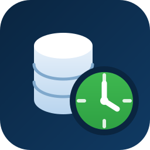

<div align="center">



# SQL Server Agent Jobs for VS Code

**Monitor, manage, and edit SQL Server Agent jobs without leaving VS Code.**

A dashboard with run statistics, a job tree with live status, and a full editor
for job options, schedules, and steps — everything you'd normally open SSMS for.


</div>

---

## Features

### 📊 Dashboard landing page
Opens automatically when you connect:

- **Success/fail bar chart** — stacked green/red bars per day, with a **slider to set the span from 1 to 30 days**
- **Job list** — every job with live status, last run, and next run
- **Recent history** — latest runs across all jobs with durations and messages
- **Click any row** to jump straight into that job's editor
- **Export** the job + schedule inventory as CSV, JSON, or Markdown

### 🌲 Job tree view
A view in the Activity Bar showing all SQL Agent jobs with color-coded status icons:

- 🟢 Succeeded · 🔴 Failed · 🔵 Running (spinning) · ⚪ Disabled / never run
- Expand a job for its **Schedules** (human-readable frequencies like *"Daily, every 4h"* or *"Weekly on Mon, Wed, Fri"*), **Steps**, and **History** (last 20 runs with error messages in tooltips)
- Right-click actions: Enable / Disable / Start / Stop / Add Schedule
- Auto-refresh (configurable, default 60s)

### ✏️ Full job editor
Click **Options** under any job (or any dashboard row) to open the editor in the main window:

- **Job options** — name, category, owner, enabled, description
- **Schedules** — inline editor for daily/weekly/monthly recurrence, run-at time or repeat every N minutes/hours; enable, disable, or remove
- **Steps** — add, edit, and delete steps: command text, subsystem (T-SQL / CmdExec / PowerShell), target database, on-success/on-failure flow control, and retry settings
- **Run Job Now** + the last 10 runs with full agent messages

All changes go through the official `msdb` stored procedures (`sp_update_job`,
`sp_update_schedule`, `sp_update_jobstep`, …) — exactly what SSMS uses.

## Requirements

- The [SQL Server (mssql)](https://marketplace.visualstudio.com/items?itemName=ms-mssql.mssql) extension — connection profiles defined there are reused, so there's nothing extra to configure
- A SQL Server with SQL Server Agent running
- Permissions on `msdb`:
  - viewing requires `SQLAgentReaderRole` (or higher)
  - starting/stopping jobs and editing requires `SQLAgentOperatorRole`, job ownership, or `sysadmin`

Both **SQL authentication** and **Windows (Integrated) authentication** profiles are supported.
SQL auth passwords are requested once and cached in VS Code's encrypted Secret Storage
(clear anytime with the *"SQL Agent Jobs: Forget Saved Password"* command).

## Getting started

1. Install the extension (see below)
2. Define a connection in the SQL Server (mssql) extension if you haven't already
3. Open the **SQL Agent Jobs** view in the Activity Bar
4. Click the **plug icon** and pick a connection profile
5. The dashboard opens — explore from there

## Installation

### From VSIX

Grab the `.vsix` from [Releases](../../releases) and either:

```
code --install-extension mssql-agent-jobs-x.y.z.vsix
```

or in VS Code: **Extensions panel → ⋯ menu → Install from VSIX…**

### Build from source

```bash
git clone <this repo>
cd mssql-agent-jobs
npm install
npm run compile          # type-check + esbuild bundle
npx @vscode/vsce package # produces the .vsix
```

Press <kbd>F5</kbd> in VS Code to run the extension in a development host.

## Settings

| Setting | Default | Description |
|---|---|---|
| `sqlAgentJobs.autoRefreshInterval` | `60` | Tree auto-refresh interval in seconds (`0` disables) |

## Notes

- A SQL Agent schedule can be **shared by several jobs** — editing or disabling it affects all of them (same behavior as SSMS)
- How far back the dashboard chart can reach depends on SQL Server Agent's history retention (default caps at ~1000 rows total); raise it under *SQL Server Agent → Properties → History* if needed
- Changing a job's **owner** typically requires `sysadmin`

## Tech

TypeScript · VS Code Extension API (TreeView + Webview) · [mssql](https://www.npmjs.com/package/mssql) driver · esbuild (single ~500 KB VSIX)

## License

[MIT](LICENSE)
